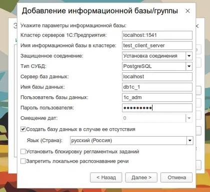
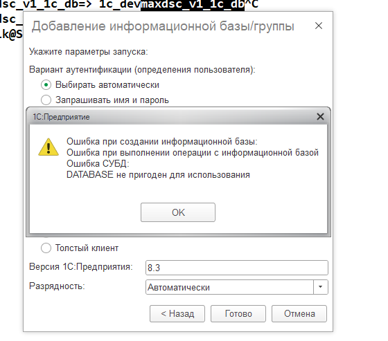
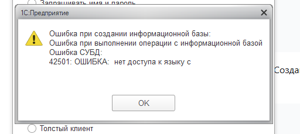
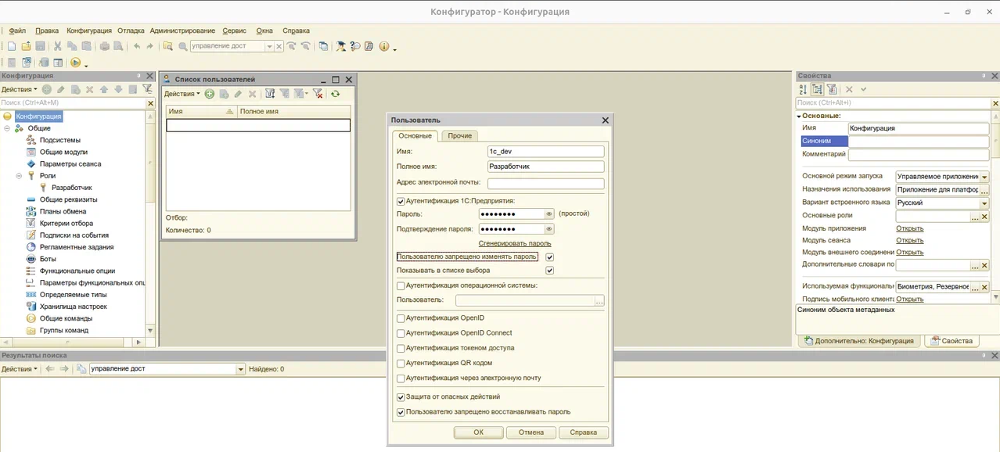
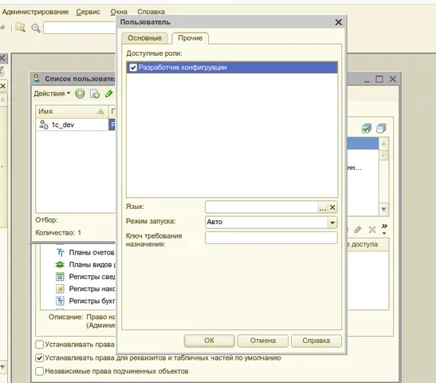

# Установка клиента, сервера 1С:Предприятие под Community лицензией, СУБД PostgreSQL, а также их настройка.

#### Данная памятка описывает шаги, которые я проделал для установки клиента, сервера и СУБД PostgreSQL для 1С:Предприятие (Community лицензия). Результатом является настроенная система взаимодействия клиента и сервера 1С:Предприятие на разных машинах.

## Цели и задачи

Цель: используя два физических ПК под управлением разных операционными системами наладить клиент-серверное взаимодействие для 1С:Предприятие (Community лицензия).
Задачи:
1. [Установить 1С:Предприятие на сервер и на клиент](#1)
2. [Установить PostgreSQL на сервер](#2).
3. [Настроить PostgreSQL для работы администратора информационной базы и пользователя](#3).
4. [Настроить службу сервера и группы пользователей 1С:Предприятие](#4).
5. [Создать конфигурацию на сервере 1С:Предприятие](#5).
6. [Активировать комьюнити-лицензии на клиентском и сервером ПК](#6).
7. [Создать роли администратора конфигурации и обычного пользователя](#7).
8. [Проверить подключение с клиента](#8).
## Используемое ПО
1. Компоненты комьюнити-лицензии (скачаны с [developer.1c.ru](https://developer.1c.ru))
- Клиент 1С:Предприятия версии 8.3.27.1688, установлен на ОС Windows 11, 64 bit;
- Сервер 1С:Предприятия версии 8.3.27.1688, установлен на ОС Ubuntu 24.04.3 LTS (Noble Numbat) с графическим интерфейсом, 64 bit;
- СУБД PostgreSQL версии 16.3-16.1c (DEB), установлен на ОС Ubuntu 24.04.3 LTS (Noble Numbat) с графическим интерфейсом, 64 bit;
## Проделанная работа

### <a name="1"></a> Установка 1С:Предприятие на сервер и на клиент
- Для установки клиента найти файл setup и запустить от имени администратора и далее следовать инструкциям. В выборочной установке выбрать только 1С:Предприятие, 1С:Предприятие - Тонкий-клиент,
  интерфейсы на различных языках.
- Для установки на сервер необходимо запускать файл `installAsRoot` для установки с правами суперпользователя (нужно ввести пароль суперпользователя). В выборочной установке выбирал все варианты.
### <a name="2"></a> Установка PostgreSQL на сервер

Порядок установки: `libpq5_16.3-16.1C_amd64.deb` -> `postgresql-client-16_16.3-16.1C_amd64.deb` -> `postgresql-16_16.3-16.1C_amd64.deb`.
Возникли ошибки для установки libpq5:
  ````
    Следующие пакеты имеют неудовлетворённые зависимости:
       libpq5 : Зависит: libldap-2.4-2 (>= 2.4.7) но он не может быть установлен
                Зависит: libssl1.1 (>= 1.1.1) но он не может быть установлен
  ````  
Подобные ошибки возникли и при установке других компонентов PostgreSQL. Дело в том, что сборка PostgreSQL от 1С была скомпилирована под более старые версии библиотек, которые были заменены на новые
версии в Ubuntu 24.04.3. Поэтому при установке PostgreSQL от 1С Ubuntu не может подтянуть старые версии библиотек, так как они конфликтуют с более свежими.
Данная проблема была решена путем скачивания старых библиотек с [archive.ubuntu.com](https://archive.ubuntu.com/).
Были скачаны следующие библиотеки с помощью `wget` (на момент августа 2025Г) и установлены `sudo dpkg -i`:
- [libldap-2.4-2_2.4.49+dfsg-2ubuntu1.10_amd64.deb](https://archive.ubuntu.com/ubuntu/pool/main/o/openldap/)
- [libssl1.1_1.1.1-1ubuntu2.1~18.04.23_amd64.deb](https://archive.ubuntu.com/ubuntu/pool/main/o/openssl/)
- [libllvm11_11.0.0-2~ubuntu20.04.1_amd64.deb](https://archive.ubuntu.com/ubuntu/pool/main/l/llvm-toolchain-11/)
- [libicu66_66.1-2ubuntu2.1_amd64.deb](https://archive.ubuntu.com/ubuntu/pool/main/i/icu/)
- [libffi7_3.3-4_amd64.deb](https://archive.ubuntu.com/ubuntu/pool/main/libf/libffi/)
### <a name="3"></a> Настройка PostgreSQL для работы администратора информационной базы и пользователя

После успешной установки PostgreSQL будет создан пользователь postgres, который имеет доступ к СУБД. Для проверки активности СУБД PostgreSQL используется команда `sudo systemctl status postgresql`
Файлы конфигурации PostgreSQL:
````
/etc/postgresql/16/main/postgresql.conf — основной файл конфигурации. Здесь настраиваются общие параметры: память, порт (по умолчанию 5432), файлы журналов и т.д.
/etc/postgresql/16/main/pg_hba.conf — файл управления доступом. Здесь прописывается, с каких машин и под какими пользователями можно подключаться к серверу.
````
Поменял закомментированную строку `#listen_addresses` в `postgresql.conf` (значение '*' означает "слушать на всех сетевых интерфейсах"):
````
listen_addresses = '*'
````
Для порта PostgreSQL следует разблокировать соединения в Firewall
````
sudo ufw allow 5432/tcp
````
Вошел в psql под root:
````
sudo -u postgres psql
````
Создал администратора с правами суперпользователя для 1с, от которого будут создаваться информационные базы и конфигурирование
````
 CREATE ROLE "1c_adm" WITH LOGIN SUPERUSER CREATEDB CREATEROLE PASSWORD '11111111';
````
Задал ограничения для администратора в `pg_hba.conf`:
```
# Database administrative login by Unix domain socket
local   all             postgres                                peer

# TYPE  DATABASE        USER            ADDRESS                 METHOD

# "local" is for Unix domain socket connections only
local   db1c_1             1c_adm                                  md5
# IPv4 local connections:
host    db1c_1             1c_adm          127.0.0.1/32            md5
# IPv6 local connections:
#host    all             all             ::1/128                 scram-sha-256
# Allow replication connections from localhost, by a user with the
# replication privilege.
local   replication     all                                     peer
host    replication     all             127.0.0.1/32            scram-sha-256
#host    replication     all             ::1/128                 scram-sha-256
```
Перезагрузил PostgreSQL:
````
sudo systemctl restart postgresql
````
Ограничения таковы, что пользователь 1c_adm может работать только локально на компьютере сервера и подключать только к БД db1c_1, которая будет создана позже.

### <a name="4"></a> Настройка службы сервера и группы пользователей 1С:Предприятие

Запустил службы сервера 1С:Предприятие:
- Создание ссылки с именем ...@default.service, которая указывает на оригинальный файл ...@.service.
  ````
  sudo ln /opt/1cv8/x86_64/8.3.27.1688/srv1cv8-8.3.27.1688@{,default}.service
  ````
- Создание символической ссылки на файл службы в специальном каталоге, где systemd ищет службы
  ````
  sudo systemctl link /opt/1cv8/x86_64/8.3.27.1688/srv1cv8-8.3.27.1688@default.service
  ````
- Включение автозапуска и запуск службы
  ````
  systemctl enable srv1cv8-8.3.27.1688@.service
  systemctl start srv1cv8-8.3.27.1688@.service
  ````
При установке сервера 1С:Предприятие была создана группа пользователей `grp1cv8` основная задача которой — предоставить права на чтение и запись в рабочие каталоги сервера 1С (например,
`/var/opt/1c/1cv8/`,
`/home/usr1cv8/`) всем процессам, входящим в эту группу. Чтобы корректно запускать сервер или активировать лицензию необходимо, чтобы пользователь входил в эту группу.
```` 
sudo usermod -a -G grp1cv8 <user>
````
### <a name="5"></a> Создание конфигурации на сервере 1С:Предприятие

Схема работы с клиент-серверной конфигурацией простая: есть администратор 1c с правами суперпользователя 1c_adm. Администратор
создает на сервере информационную базу. Затем у администратора можно отобрать права суперпользователя и оставить только необходимые права для работы с конфигурацией.

С помощью 1cestart запустил графическую программу запуска 1С:Предприятие -> Добавить... -> Создание новой информационной базы -> ...без конфигурации... -> На сервере 1С:Предприятие. Заполнил поля как
на картинке ниже\


#### Так как пользователь 1c_adm обладает правами суперпользователя, то не возникнет множества ошибок при создании БД, например:
- Ошибка "DATABASE не пригоден для использования", возникающей при подключении к ранее созданной БД (так как 1С использует свой алгоритм создания БД с переписыванием обработчика plpgsql)
  
- Ошибка "Нет доступа к языку С", возникающей из-за того, что 1С хочет переписать обработчик plpgsql, но у нее нет прав доступа к языку СИ, а такой доступ есть только у суперпользователя.
  
### <a name="6"></a> Активация комьюнити-лицензии на клиентском и сервером ПК.

Для активации лицензии на сервере нужно зайти в конфигуратор и выбрать пункт активировать комьюнити-лицензию. Заполнить свой логин и пароль с сайта [developer.1c.ru](https://developer.1c.ru). После
чего лицензия
будет в домашнем каталоге текущего пользователя `~/.1cv8/1C/1cv8/conf`. Файл будет иметь расширение `.lic`. Если 1С:Предприятие просит
повторно активировать лицензию, то нужно переместить файл из `~/.1cv8/1C/1cv8/conf` в `/var/1C/licenses/`. Если текущий пользователь не является членом группы grp1cv8, то активация все равно не
пройдет.\
Для активации лицензии на клиенте нужно зайти в конфигуратор и выбрать пункт активировать комьюнити-лицензию.

### <a name="7"></a> Создание роли разработчика конфигурации и обычного пользователя

Лишаем пользователя 1c_adm прав суперпользователя
````
ALTER ROLE "1c_adm" WITH NOSUPERUSER NOCREATEDB NOCREATEROLE;
````
Так как 1c_adm владелец БД db1c_1, то ему будут доступны все команды конфигуратора.
Далее через конфигуратор создал роль "Разработчик" с полными правами. Затем через панель администрирования создал пользователя 1c_dev с паролем.



### <a name="8"></a> Подключение к серверу с клиента

Для подключения к серверу 1С необходимо выбрать пункт: Добавление в список существующей информационной базы -> На сервере 1С:Предприятие. В поле "Кластер серверов указать" IP-адрес сервера и порт
1541, например, `192.168.101.37:1541`. В поле "Имя информационной базы" указать название базы, как оно было указано при создании на сервере.