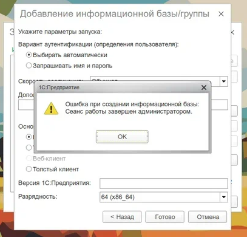

## Проблема удаления информационной базы на сервере 1С:Предприятие.

Если удалить информационную базу из списка баз на сервере 1С:Предприятие, а затем удалить привязанную базу из PostgreSQL, то будет возникать проблема подключения сервера 1С к несуществующей БД. Так
как БД в PostgreSQL была
удалена, а из кластера нет.
Симптомы:
- При подключении к информационной базе или при создании новой информационной базы выводится ошибка: "Сеанс работы завершен администратором"
  
- В логах `/var/log/postgresql` будут записи по типу:
```
 1c_dev@db_1 ВАЖНО:  база данных "db_1" не существует
```
##### Схема правильного удаления информационной базы из кластера 1С и из PostgreSQL (взята с этого [сайта](https://oparin.info/stati/administrirovanie-serverov-1s-pod-linux-ubuntu/?ysclid=mf714mgc5l82617343))

Включить кластер серверов
```
/opt/1cv8/x86_64/8.3.27.1688/ras --daemon cluster
```
Посмотреть список кластеров
```
/opt/1cv8/x86_64/8.3.27.1688/rac cluster list
```
Скопировать номер cluster c879d625-b3b2-46f6-a24b-b2d99c66ec35\
Посмотреть список баз
```
/opt/1cv8/x86_64/8.3.27.1688/rac infobase --cluster=c879d625-b3b2-46f6-a24b-b2d99c66ec35 summary list
```
Скопировать infobase 2e49bac8-ba23-446c-93ad-50dd1bb6b63e\
Удалить базу
```
/opt/1cv8/x86_64/8.3.27.1688/rac infobase --cluster=c879d625-b3b2-46f6-a24b-b2d99c66ec35 drop --infobase=2e49bac8-ba23-446c-93ad-50dd1bb6b63e
```
Удалить БД из PostgreSQL
```
DROP DATABASE "db_1";
```